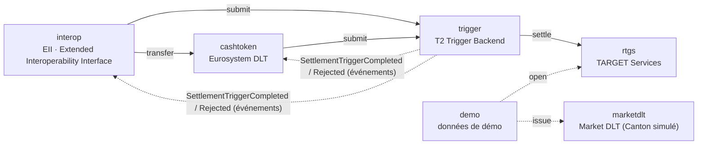
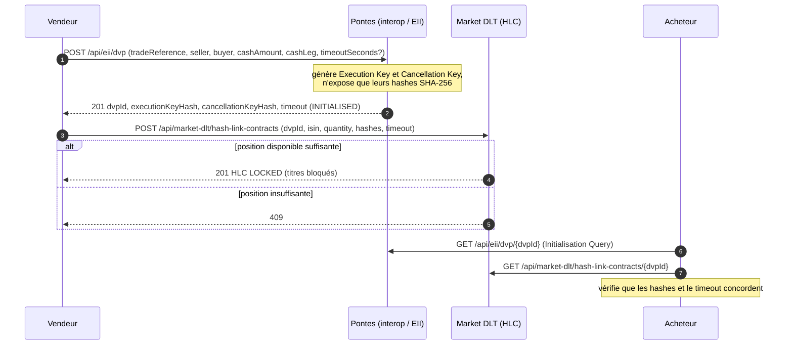
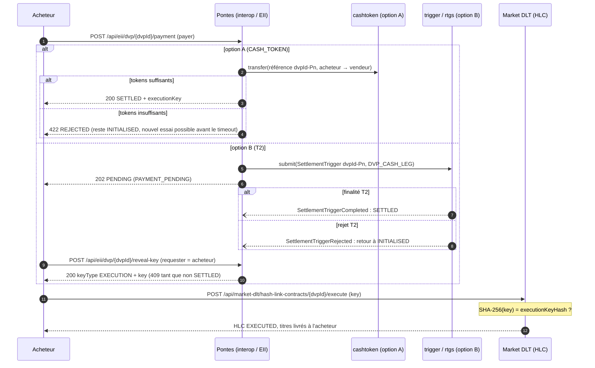
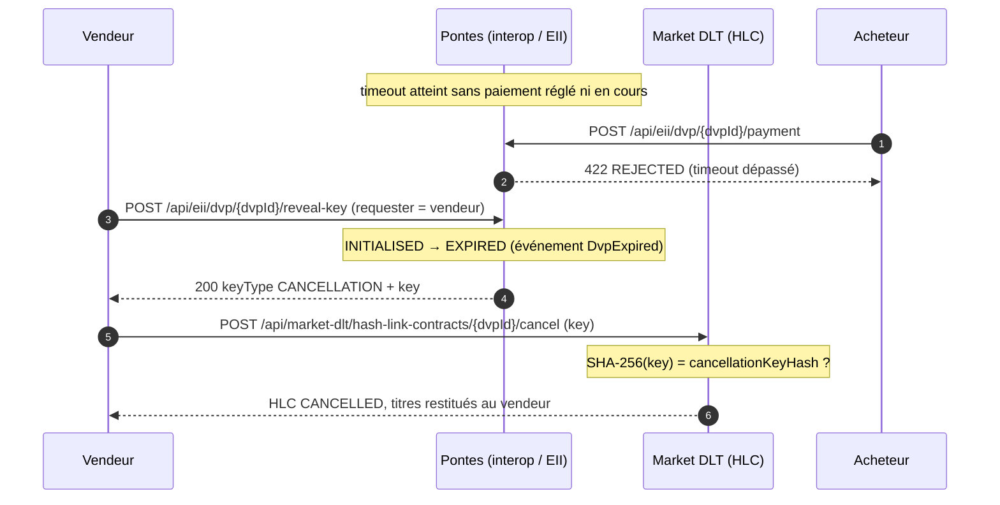

🇬🇧 English version: [README.md](README.md)

[](https://github.com/Bonnai2112/pontes-dlt-settlement/actions/workflows/ci.yml)
[](LICENSE)

# POC Pontes — règlement d'actifs tokenisés en monnaie de banque centrale

> **Avertissement.** Preuve de concept indépendante et pédagogique, fondée sur la documentation publique de
> la BCE. Elle n'est ni affiliée à la Banque centrale européenne, à l'Eurosystème ou à une banque centrale
> nationale, ni approuvée par elles. Les banques, BIC et ISIN des données de démo sont fictifs. Pas
> d'usage en production : voir [SECURITY.md](SECURITY.md).

Preuve de concept de l'architecture **Pontes** de la BCE / Eurosystème, implémentée en
**monolithe modulaire** avec Spring Boot 4.1 et Spring Modulith 2.1 (Java 21).

## Contexte

Pontes (« le pont ») est le programme de l'Eurosystème qui relie les plateformes DLT de marché au
règlement en **monnaie de banque centrale (MBC / CeBM)**. Objectifs :

- **le règlement le plus sûr** : garder la MBC comme actif de règlement sans risque, y compris pour les
  actifs tokenisés ;
- **répondre au marché** : soutenir la tokenisation déjà demandée par les acteurs financiers (essais BCE
  2024 : 64 participants, plus de 50 essais réglés en MBC, par exemple BNP Paribas Neobonds ou Goldman Sachs
  pour du repo intraday en DvP) ;
- **une Europe digitale** : avancer vers une union des marchés de capitaux plus intégrée.

Pontes ne réécrit pas TARGET : il **connecte le cœur RTGS existant au monde DLT** à travers 4 briques,
avec un **modèle à double règlement** pour la livraison contre paiement (DvP) :

- **Option A (cash tokens)** : la jambe cash est réglée sur la plateforme DLT de l'Eurosystème ;
- **Option B (T2)** : la jambe cash est réglée brute en temps réel, directement en T2.

Dans les deux cas, la jambe cash est finalisée en MBC via T2 : les cash tokens sont adossés 1:1 à de la MBC
bloquée sur un compte technique RTGS. Le pilote Pontes est en service depuis le 21 septembre 2026.
Besu et Canton sont cités comme choix techniques illustratifs, que la BCE n'a pas arrêtés publiquement.

Sources : ecb.europa.eu/paym/target/pontes, et l'URD Pontes v1.0 (User Requirements Document, BCE)
pour le protocole DvP Hash-Link (§4.2) :
<https://www.ecb.europa.eu/paym/target/target-professional-use-documents-links/pontes/shared/pdf/ecb.pontes260417_urd1.en.pdf>
(voir aussi `POC DL3S v2.pdf`).

## Correspondance briques Pontes ↔ modules

Un module Spring Modulith = un bounded context, sous `com.dl3s.pontes`. Les types à la racine d'un module
constituent son API publique. Les sous-packages (`application`, `domain`, `web`, `infrastructure`) sont
internes et leur accès depuis un autre module est refusé par `ApplicationModules.verify()`.

| Brique Pontes (PDF)            | Module      | API publique                                   | REST                         |
|--------------------------------|-------------|------------------------------------------------|------------------------------|
| 01 TARGET Services (RTGS+ESMIG) | `rtgs`      | `RtgsAccounts`, `RtgsTransferSettled`          | `/api/target/accounts`       |
| 02 T2 interface (Trigger Backend) | `trigger` | `TriggerBackend`, `SettlementTriggerCompleted/Rejected` | `/api/t2/triggers`   |
| 03 Eurosystem DLT (cash tokens, Besu) | `cashtoken` | `CashTokenLedger`, `CashTokensMinted/Redeemed` | `/api/dlt/...`          |
| Market DLT (ex. Canton, simulée) | `marketdlt` | `SecuritiesLedger`, `HashLinkTerms`, `HashLinkContractView` | `/api/market-dlt/...` (dont `hash-link-contracts`) |
| 04 EII · Extended Interoperability Interface | `interop` | `DvpInitialisation`, `DvpView`, `DvpPaymentResult`, `RevealedKey`, `CashLegOption`, `DvpSettled`, `DvpExpired` | `/api/eii/dvp` |
| (outillage) données de démo    | `demo`      | aucune                                         | aucun                        |

## Dépendances entre modules



Les flèches pleines sont des appels synchrones via l'API publique. Les flèches pointillées issues de
`trigger` sont des événements traités par des `@ApplicationModuleListener` : asynchrones, transactionnels,
publiés après commit et persistés dans le registre de publication d'événements JPA de Spring Modulith.
Il n'y a aucune flèche entre `interop` et `marketdlt` : Pontes ne touche jamais la market DLT. Ce sont les
parties qui y bloquent et y dénouent les titres, avec les clés révélées par Pontes.

### Règles de dépendances (`allowedDependencies`)

Déclarées dans le `package-info.java` de chaque module et vérifiées par `ModularityTests` :

| Module      | `allowedDependencies`                 | Justification                                                    |
|-------------|---------------------------------------|------------------------------------------------------------------|
| `rtgs`      | `{}`                                  | Cœur critique stable : ne dépend de personne.                    |
| `trigger`   | `rtgs`                                | Transforme les déclencheurs DLT en ordres RTGS.                  |
| `cashtoken` | `trigger`                             | Mint et redeem passent par le Trigger Backend, jamais directement par le RTGS. |
| `marketdlt` | `{}`                                  | Externe à l'Eurosystème : ne connaît que ses registres.          |
| `interop`   | `cashtoken`, `trigger`                | Jambe cash du DvP Hash-Link ; ne dépend pas de la market DLT.    |
| `demo`      | `rtgs`, `marketdlt`                   | Seeder ; aucun module métier ne dépend de lui.                   |

Le graphe est acyclique : `trigger` ne connaît pas ses abonnés, qui reçoivent le résultat par événement.

## Les deux flux DvP : protocole Hash-Link

Le DvP suit le protocole Hash-Link de l'URD Pontes (§4.2). Pontes ne connaît que la jambe cash (parties,
montant, option A ou B) ; l'ISIN et la quantité sont convenus entre les parties et ne sont connus que de la
market DLT. Pontes génère deux clés aléatoires de 256 bits, une **Execution Key** et une **Cancellation Key**,
et ne publie que leur hash SHA-256. Le vendeur bloque ses titres sur la market DLT dans un **Hash-Link
Contract** (HLC) qui ne se dénoue que sur présentation d'une clé dont le hash correspond : l'Execution Key
livre les titres à l'acheteur, la Cancellation Key les restitue au vendeur. Pontes ne révèle l'Execution Key
qu'après règlement de la jambe cash, et la Cancellation Key qu'après le timeout sans paiement : les deux ne
peuvent jamais être révélées pour la même instance. L'atomicité repose sur ces clés et sur le timeout, pas
sur une orchestration centrale ni sur une transaction commune aux deux DLT.

Cycle de vie d'une instance côté Pontes : `INITIALISED → (PAYMENT_PENDING →) SETTLED`, ou
`INITIALISED → EXPIRED`. Côté market DLT, le HLC passe de `LOCKED` à `EXECUTED` ou `CANCELLED`.

### Phase 1 — initialisation



L'initialisation est idempotente sur `tradeReference` : une requête rejouée renvoie la même instance (même
`dvpId`, mêmes hashes). Le timeout par défaut est de 10 minutes et ne peut dépasser 1 heure
(`pontes.hash-link.default-timeout` et `pontes.hash-link.max-timeout`, réglés par le Pontes Operator) ;
au-delà, 400.

### Phase 2a — règlement et livraison



Différences entre les deux options :

- **Option A (cash tokens)** : pré-requis, l'acheteur a émis des cash tokens (mint), c'est-à-dire que la MBC
  est passée de son compte RTGS au compte technique `EUROSYSTEM-DLT-TA` via le Trigger Backend. Le transfert
  de tokens est synchrone : la réponse au paiement est `200 SETTLED` avec l'Execution Key, ou `422 REJECTED`.
- **Option B (T2)** : le paiement est un déclencheur `DVP_CASH_LEG` transmis au Trigger Backend, réglé brut
  en RTGS. La réponse est `202 PENDING` ; la finalité T2 arrive par événement. L'acheteur obtient ensuite
  l'Execution Key par une demande Reveal Key. Un rejet T2 (provision insuffisante) ramène l'instance à
  `INITIALISED`, avec le motif dans `lastRejectionReason`.

Chaque tentative de paiement a sa propre référence de règlement `<dvpId>-P<n>`, idempotente côté DLT et côté
Trigger Backend / RTGS. Un paiement rejoué sur une instance déjà `SETTLED` renvoie la même Execution Key sans
nouveau règlement. Seul l'acheteur peut payer ou obtenir l'Execution Key ; un tiers reçoit 403.

### Phase 2b — expiration et restitution



Avant le timeout, ou si un paiement est réglé ou en cours (`PAYMENT_PENDING`), la Cancellation Key n'est pas
révélée (409). Une fois l'instance `EXPIRED`, tout paiement est refusé (422). Une clé dont le hash ne
correspond pas est refusée par le HLC (400) et les titres restent bloqués.

Les titres ne quittent le vendeur que contre l'Execution Key, qui n'existe hors de Pontes qu'après finalité
de la jambe cash : il n'y a pas de risque en principal.

## Lancer le POC

Pré-requis : **JDK 21** et Maven 3.8+.

```bash
export JAVA_HOME=/chemin/vers/jdk-21
mvn spring-boot:run
```

Par défaut, la DLT de l'Eurosystème utilise un **adapter en mémoire** (registre chaîné par hash, persisté
dans H2). Au démarrage, `pontes.demo.enabled=true` ouvre les comptes RTGS `EUROSYSTEM-DLT-TA` (0),
`BANKAFRPP` (10 M), `BANKCDEFF` (10 M) et `BANKBFRPP` (5 M), et émet 1 000 titres de l'obligation numérique
fictive `XS0000000001` pour `BANKBFRPP`. Pour démarrer à vide :
`mvn spring-boot:run -Dspring-boot.run.arguments=--pontes.demo.enabled=false`.

Le fichier [`requests.http`](requests.http) déroule le scénario complet : comptes, mint, DvP Hash-Link A
(succès, paiement refusé, expiration et annulation) et B (paiement T2 asynchrone), redeem, registre,
vérification de la chaîne et `/actuator/modulith`. Les identifiants et les clés sont chaînés d'une requête à
l'autre par des variables globales du client HTTP.

### Mode Besu

Nœud Hyperledger Besu local (QBFT, 1 validateur) fourni par `docker-compose.yml` et `besu/` :

```bash
docker compose up -d
mvn spring-boot:run -Dspring-boot.run.profiles=besu
```

Le profil `besu` remplace l'adapter en mémoire du port `TokenLedgerPort` par un adapter web3j
(configuration dans `application-besu.yml`).

Prérequis : Docker, et JDK 21 dans `JAVA_HOME` (`/opt/homebrew/opt/openjdk@21` en local).

**Réseau.** `besu/genesis.json` a été généré par `besu operator generate-blockchain-config` à partir de
`besu/qbftConfigFile.json` : consensus QBFT (PoA permissionné), un seul validateur (`besu/validator/key`),
un bloc par seconde, frais nuls, `chainId` 1337. Le compte opérateur Eurosystème
(`0xfe3b…dbd73`, clé de développement publique Besu) y est pré-financé. Les données de chaîne vivent
dans le conteneur : un redémarrage repart d'une chaîne vierge, comme la base H2.

**Smart contract.** `contracts/src/EuroCashToken.sol` (Solidity 0.8.28), un projet Foundry bâti sur
OpenZeppelin Contracts **Upgradeable** v5.7 :

- **`ERC20Upgradeable`** : symbole `EURCT`, 2 décimales (centimes). Il émet les événements `Transfer` standard.
- **`AccessControlUpgradeable`** : `MINTER_ROLE`, `BURNER_ROLE` et `SETTLER_ROLE` pour l'opérateur ;
  `DEFAULT_ADMIN_ROLE`, `PAUSER_ROLE` et `UPGRADER_ROLE` pour l'administrateur. Les rôles sont révocables.
  Dans le POC, l'opérateur est aussi administrateur.
- **`PausableUpgradeable`** : un interrupteur d'urgence qui bloque tout mouvement (surcharge de `_update`).
- **Transferts directs désactivés** : `transfer`, `transferFrom` et `approve` renvoient
  `DirectTransferDisabled()`. Seules les instructions de règlement passées par l'EII déplacent des tokens.
- **Opérations métier** : `mint`, `burn` et `settle` (jambe cash d'un DvP). Chacune est idempotente sur sa
  référence métier et émet `Minted`, `Burned` ou `Settled`.

**Upgradabilité : pattern UUPS (ERC-1822 / ERC-1967).** Le token est un `ERC1967Proxy`, qui porte l'adresse
et l'état. Il délègue à une implémentation, qui porte la logique et autorise elle-même ses upgrades
(`_authorizeUpgrade`, réservé à `UPGRADER_ROLE`).

- **Pourquoi UUPS** : c'est le pattern recommandé par OpenZeppelin v5. Le proxy est minimal et moins cher à
  l'appel, et le droit d'upgrade est un rôle `AccessControl` comme les autres.
- **Alternatives écartées** :
  - *Transparent Proxy* : il ajoute un `ProxyAdmin` hors du modèle de rôles et un surcoût à chaque appel.
  - *Beacon* : il n'est utile que pour de nombreuses instances identiques.
  - *Diamond (EIP-2535)* : trop complexe à auditer pour ce périmètre.
- **Stockage namespacé ERC-7201.** Tout l'état propre au contrat vit dans des espaces de noms dédiés :
  `pontes.storage.EuroCashToken` pour la V1, `pontes.storage.EuroCashTokenV2` pour la V2.
  `forge inspect <Contrat> storageLayout` renvoie un stockage séquentiel vide pour les deux versions, donc
  aucune collision n'est possible entre elles.
- **Initialisation.** Il n'y a pas de constructeur métier. `initialize(admin, operator)` est appelé par le
  proxy dans sa transaction de création, donc personne ne peut s'intercaler. L'implémentation elle-même est
  verrouillée par `_disableInitializers()`.
- **V2 d'exemple** (`contracts/src/EuroCashTokenV2.sol`) : le gel des avoirs d'un participant
  (`FREEZER_ROLE`, `freeze` / `unfreeze`, erreur `AccountFrozen`). `initializeV2` est exécutée atomiquement
  avec l'upgrade (`upgradeToAndCall`, `reinitializer(2)`).
- **Gouvernance en production** : `UPGRADER_ROLE` serait détenu par un `TimelockController` derrière un
  multisig, avec des clés distinctes pour l'opérateur, l'administrateur et l'upgrader.

Tests Foundry :

- `contracts/test/EuroCashToken.t.sol` : le token déployé derrière son proxy. Rôles, idempotence, solde
  insuffisant, pause, révocation, transferts directs, et impossibilité de réinitialiser le proxy comme
  l'implémentation.
- `contracts/test/EuroCashTokenUpgrade.t.sol` : l'upgrade vers la V2. Adresse, soldes, rôles et références
  traitées sont conservés ; le slot ERC-1967 change ; seul `UPGRADER_ROLE` peut upgrader ; `initializeV2`
  ne s'exécute qu'une fois ; le gel est appliqué.

Le build (Foundry via Docker) télécharge les dépendances aux versions figées, compile, teste, puis exporte
l'ABI et le bytecode de `EuroCashToken` et de `ERC1967Proxy` dans `src/main/resources/contracts/`, où ils
sont versionnés :

```bash
./contracts/build.sh
```

**Déploiement.** Au démarrage, si `pontes.besu.contract-address` est vide, `BesuTokenLedger` déploie
l'implémentation V1, puis le proxy qui l'initialise, et écrit l'adresse du proxy dans les logs
(`EuroCashToken (proxy UUPS) sur Besu … à l'adresse 0x…`). Si l'adresse est renseignée, l'application se
rattache au proxy existant, quelle que soit la version derrière. Chaque écriture est une transaction signée
par l'opérateur (web3j 6, `FastRawTransactionManager`), attendue jusqu'à son inclusion dans un bloc. En QBFT,
la finalité est immédiate. Si la même clé signe hors de l'application (script, `cast`), l'adapter détecte le
nonce périmé, se resynchronise sur le nœud et renvoie la transaction. Les rejets du contrat (compte gelé,
pause…) sont traduits en motifs lisibles.

**Upgrade vers la V2 sur le nœud local**, application démarrée, sans interruption ni changement d'adresse :

```bash
cd contracts
docker run --rm -v "$PWD:/work" -w /work \
  -e PROXY=<adresse du proxy> \
  -e UPGRADER_KEY=0x8f2a55949038a9610f50fb23b5883af3b4ecb3c3bb792cbcefbd1542c692be63 \
  -e FREEZER=0xfe3b557e8fb62b89f4916b721be55ceb828dbd73 \
  --entrypoint forge ghcr.io/foundry-rs/foundry:stable \
  script script/UpgradeToV2.s.sol --rpc-url besu --broadcast --legacy --with-gas-price 0 --slow

# Geler un participant (adresse = 0x + 40 derniers caractères de keccak256("pontes:participant:<BIC>"))
docker run --rm --entrypoint cast ghcr.io/foundry-rs/foundry:stable send <proxy> 'freeze(address)' <adresse> \
  --private-key <UPGRADER_KEY> --rpc-url http://host.docker.internal:8545 --legacy --gas-price 0
```

Un paiement DvP option A impliquant un participant gelé est refusé (`422 REJECTED`, motif « compte gelé sur
la DLT ») ; l'instance reste `INITIALISED` et les titres restent bloqués dans le HLC jusqu'à un nouveau
paiement ou jusqu'à l'annulation par le vendeur après le timeout.

**Participants.** Sur ce réseau permissionné, seul l'opérateur signe. Chaque participant reçoit donc une
adresse dérivée de son identifiant (`keccak256("pontes:participant:<BIC>")`), enregistrée dans la table
`dlt_participant_address`.

**Vérification.** `GET /api/dlt/ledger` reconstruit l'historique à partir des événements du contrat
(`sequence` = numéro de bloc, `previousHash` = hash du bloc, `hash` = hash de transaction).
`GET /api/dlt/ledger/verify` compare le `totalSupply` du contrat aux événements. L'encours doit être égal au
solde RTGS du compte `EUROSYSTEM-DLT-TA`. On peut aussi interroger le nœud directement :

```bash
curl -s -X POST -H 'Content-Type: application/json' localhost:8545 \
  --data '{"jsonrpc":"2.0","method":"eth_blockNumber","params":[],"id":1}'
```

## Tests

```bash
mvn test
```

Les tests n'ont besoin ni de Docker ni de Besu : ils utilisent l'adapter en mémoire.

| Classe                               | Contenu                                                                                  |
|--------------------------------------|------------------------------------------------------------------------------------------|
| `ModularityTests`                    | `ApplicationModules.verify()` et génération de la documentation dans `target/spring-modulith-docs` (C4 PlantUML, module canvases, document agrégé). |
| `CashTokenIntegrationTests`          | Mint (RTGS débité, compte technique crédité, wallet crédité, chaîne vérifiée), mint rejeté faute de provision, redeem, redeem au-delà du solde. |
| `DvpSettlementIntegrationTests`      | Hash-Link option A et B : succès avec Execution Key, paiement refusé puis retry, expiration avec Cancellation Key, clé invalide refusée par le HLC, tiers refusé (403), idempotence sur `tradeReference`. |
| `DemoDataIntegrationTests`           | Données créées par le seeder.                                                            |
| `ApiGatewayWebTests`                 | MockMvc : DvP Hash-Link option B de bout en bout (initialisation, HLC, paiement, reveal-key, 403 pour un tiers, execute), paiement refusé en 422, 400 de validation, 400 métier, 404, `/actuator/modulith`. |
| `trigger.TriggerBackendModuleTests`  | `@ApplicationModuleTest` (module `trigger` et sa dépendance `rtgs` seulement) avec l'API `Scenario` pour attendre les événements publiés. |

Pour l'asynchrone, les tests utilisent Awaitility ou `Scenario`. L'isolation repose sur des participants,
ISIN et références uniques par test. `src/test/resources/config/application.yml` donne à chaque contexte
Spring de test sa propre base H2, ce qui évite les interférences entre contextes mis en cache.

## Limites du POC

- **Hash-Link partiel.** Seuls les chemins par clé sont implémentés : pas de libération des titres par
  consentement signé du vendeur ou de l'acheteur prévue par l'URD. Le HLC simulé enregistre le timeout mais
  ne le vérifie pas : il accepte une clé valide à tout moment, et c'est Pontes seul qui garantit qu'une seule
  des deux clés est révélée. L'expiration n'est constatée qu'à la demande (paiement ou Reveal Key du vendeur),
  sans tâche planifiée ni notification des parties.
- **Pas d'authentification ESMIG.** Les champs `seller`, `payer` et `requester` sont déclaratifs : l'identité
  est un simple BIC fourni par l'appelant, sans certificat ni signature. Le contrôle « seul l'acheteur paie,
  seules les parties obtiennent une clé » (403) ne vaut donc que pour un appelant honnête. De même, la market
  DLT ne vérifie pas l'identité de l'appelant qui bloque, exécute ou annule un HLC.
- **Clés en clair.** Pontes conserve les clés en base H2 sans chiffrement ni HSM, et les révèle en clair dans
  les réponses REST.
- **Simulations.** Le RTGS, l'ESMIG, le Trigger Backend et la market DLT sont des simulations très
  simplifiées. Il n'y a ni ISO 20022, ni plages horaires T2, ni liquidité intrajournalière, ni gestion des
  files d'attente.
- **Aucune sécurité.** Pas d'authentification ni d'autorisation, pas de mTLS, pas de signature des
  instructions. En dehors du DvP, n'importe quel appelant peut débiter n'importe quel compte.
- **Persistance.** Base H2 en mémoire, schéma `create-drop` : tout est perdu à l'arrêt. Il n'y a pas de
  migrations (Flyway ou Liquibase).
- **Fiabilité de l'asynchrone.** Le registre de publication Spring Modulith rejoue les événements non
  traités au redémarrage (`republish-outstanding-events-on-restart`), mais il n'y a ni reprise
  périodique, ni DLQ, ni supervision des publications incomplètes.
- **Monnaie et arrondis.** Montants en `BigDecimal` à 2 décimales, EUR uniquement.
- **État entre redémarrages (mode Besu).** Si l'on rattache l'application à un proxy existant
  (`contract-address`), la chaîne garde les tokens alors que la base H2 (RTGS, instances DvP) repart de zéro.
  L'égalité entre l'encours et le compte technique n'est alors plus vérifiable.
- **Mode Besu.** Il dépend d'un nœud local et d'une clé de développement publique, à ne jamais utiliser
  hors poste de développement.

## Licence

[Apache License 2.0](LICENSE). Voir [NOTICE](NOTICE) pour les composants tiers.
