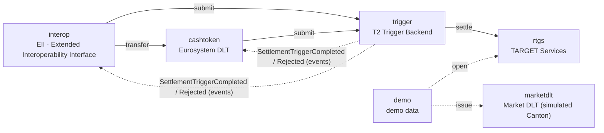
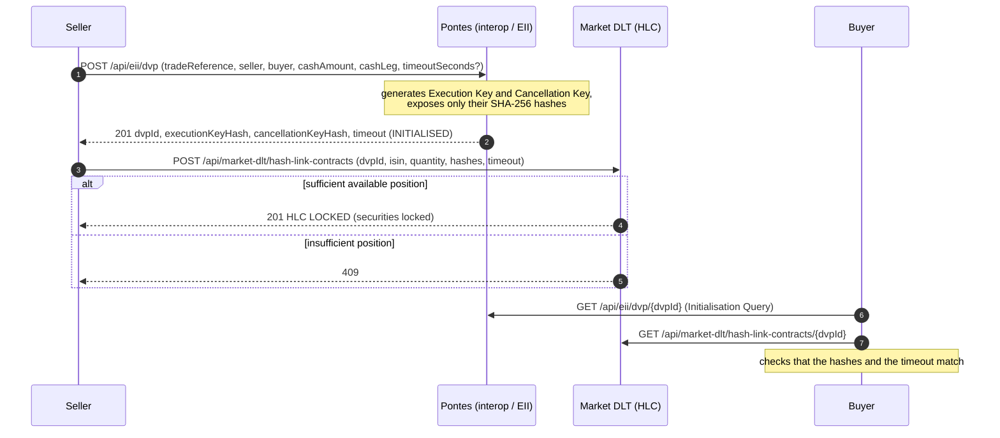
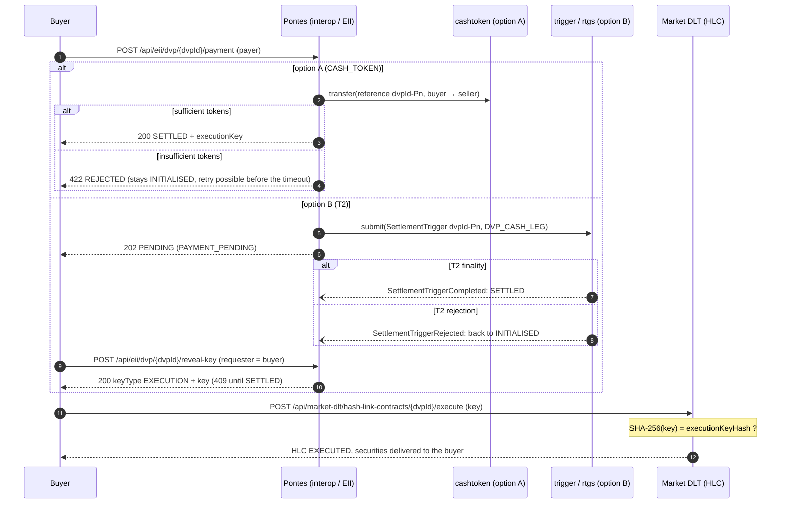
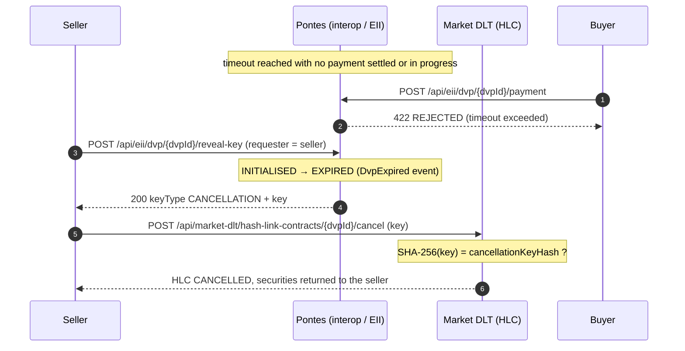

🇫🇷 Version française : [README.fr.md](README.fr.md)

[](https://github.com/Bonnai2112/pontes-dlt-settlement/actions/workflows/ci.yml)
[](LICENSE)

# POC Pontes — settlement of tokenised assets in central bank money

> **Disclaimer.** This is an independent, educational proof of concept based on public ECB documentation.
> It is not affiliated with, endorsed by or connected to the European Central Bank, the Eurosystem or any
> National Central Bank. All banks, BICs and ISINs in the demo data are fictional. Not for production use:
> see [SECURITY.md](SECURITY.md).

Proof of concept of the ECB / Eurosystem **Pontes** architecture, implemented as a
**modular monolith** with Spring Boot 4.1 and Spring Modulith 2.1 (Java 21).

## Context

Pontes ("the bridge") is the Eurosystem programme that connects market DLT platforms to settlement in
**central bank money (CeBM)**. Objectives:

- **the safest settlement**: keep CeBM as the risk-free settlement asset, including for tokenised
  assets;
- **meet market demand**: support the tokenisation already requested by financial players (ECB trials
  2024: 64 participants, more than 50 trials settled in CeBM, for example BNP Paribas Neobonds or Goldman Sachs
  for intraday repo in DvP);
- **a digital Europe**: move towards a more integrated capital markets union.

Pontes does not rewrite TARGET: it **connects the existing RTGS core to the DLT world** through 4 building blocks,
with a **dual settlement model** for Delivery versus Payment (DvP):

- **Option A (cash tokens)**: the cash leg is settled on the Eurosystem DLT platform;
- **Option B (T2)**: the cash leg is settled gross in real time, directly in T2.

In both cases, the cash leg is finalised in CeBM via T2: cash tokens are backed 1:1 by CeBM
blocked on an RTGS technical account. The Pontes pilot has been live since 21 September 2026.
Besu and Canton are cited as illustrative technical choices, which the ECB has not publicly settled on.

Sources: ecb.europa.eu/paym/target/pontes, and the Pontes URD v1.0 (User Requirements Document, ECB)
for the Hash Link DvP protocol (§4.2):
<https://www.ecb.europa.eu/paym/target/target-professional-use-documents-links/pontes/shared/pdf/ecb.pontes260417_urd1.en.pdf>
(see also `POC DL3S v2.pdf`).

## Mapping of Pontes building blocks ↔ modules

One Spring Modulith module = one bounded context, under `com.dl3s.pontes`. The types at the root of a module
make up its public API. Sub-packages (`application`, `domain`, `web`, `infrastructure`) are
internal, and access to them from another module is rejected by `ApplicationModules.verify()`.

| Pontes building block (PDF)    | Module      | Public API                                     | REST                         |
|--------------------------------|-------------|------------------------------------------------|------------------------------|
| 01 TARGET Services (RTGS+ESMIG) | `rtgs`      | `RtgsAccounts`, `RtgsTransferSettled`          | `/api/target/accounts`       |
| 02 T2 interface (Trigger Backend) | `trigger` | `TriggerBackend`, `SettlementTriggerCompleted/Rejected` | `/api/t2/triggers`   |
| 03 Eurosystem DLT (cash tokens, Besu) | `cashtoken` | `CashTokenLedger`, `CashTokensMinted/Redeemed` | `/api/dlt/...`          |
| Market DLT (e.g. Canton, simulated) | `marketdlt` | `SecuritiesLedger`, `HashLinkTerms`, `HashLinkContractView` | `/api/market-dlt/...` (including `hash-link-contracts`) |
| 04 EII · Extended Interoperability Interface | `interop` | `DvpInitialisation`, `DvpView`, `DvpPaymentResult`, `RevealedKey`, `CashLegOption`, `DvpSettled`, `DvpExpired` | `/api/eii/dvp` |
| (tooling) demo data            | `demo`      | none                                           | none                         |

## Dependencies between modules



Solid arrows are synchronous calls through the public API. Dotted arrows coming from
`trigger` are events handled by `@ApplicationModuleListener`s: asynchronous, transactional,
published after commit and persisted in Spring Modulith's JPA event publication registry.
There is no arrow between `interop` and `marketdlt`: Pontes never touches the market DLT. It is the
parties who lock and release the securities there, using the keys revealed by Pontes.

### Dependency rules (`allowedDependencies`)

Declared in each module's `package-info.java` and verified by `ModularityTests`:

| Module      | `allowedDependencies`                 | Rationale                                                        |
|-------------|---------------------------------------|------------------------------------------------------------------|
| `rtgs`      | `{}`                                  | Stable critical core: depends on nobody.                         |
| `trigger`   | `rtgs`                                | Turns DLT triggers into RTGS orders.                             |
| `cashtoken` | `trigger`                             | Mint and redeem go through the Trigger Backend, never directly through the RTGS. |
| `marketdlt` | `{}`                                  | External to the Eurosystem: only knows its own ledgers.          |
| `interop`   | `cashtoken`, `trigger`                | Cash leg of the Hash Link DvP; does not depend on the market DLT. |
| `demo`      | `rtgs`, `marketdlt`                   | Seeder; no business module depends on it.                        |

The graph is acyclic: `trigger` does not know its subscribers, which receive the outcome through events.

## The two DvP flows: Hash Link protocol

DvP follows the Hash Link protocol of the Pontes URD (§4.2). Pontes only knows the cash leg (parties,
amount, option A or B); the ISIN and the quantity are agreed between the parties and are only known to the
market DLT. Pontes generates two random 256-bit keys, an **Execution Key** and a **Cancellation Key**,
and publishes only their SHA-256 hashes. The seller locks its securities on the market DLT in a **Hash-Link
Contract** (HLC), which is only released upon presentation of a key whose hash matches: the Execution Key
delivers the securities to the buyer, the Cancellation Key returns them to the seller. Pontes reveals the Execution Key
only after the cash leg has settled, and the Cancellation Key only after the timeout without payment: the two can
never both be revealed for the same instance. Atomicity relies on these keys and on the timeout, not
on central orchestration nor on a transaction spanning both DLTs.

Lifecycle of an instance on the Pontes side: `INITIALISED → (PAYMENT_PENDING →) SETTLED`, or
`INITIALISED → EXPIRED`. On the market DLT side, the HLC moves from `LOCKED` to `EXECUTED` or `CANCELLED`.

### Phase 1 — initialisation



Initialisation is idempotent on `tradeReference`: a replayed request returns the same instance (same
`dvpId`, same hashes). The default timeout is 10 minutes and cannot exceed 1 hour
(`pontes.hash-link.default-timeout` and `pontes.hash-link.max-timeout`, set by the Pontes Operator);
beyond that, 400.

### Phase 2a — settlement and delivery



Differences between the two options:

- **Option A (cash tokens)**: prerequisite, the buyer has issued cash tokens (mint), i.e. CeBM
  has moved from its RTGS account to the `EUROSYSTEM-DLT-TA` technical account via the Trigger Backend. The token
  transfer is synchronous: the payment response is `200 SETTLED` with the Execution Key, or `422 REJECTED`.
- **Option B (T2)**: the payment is a `DVP_CASH_LEG` trigger sent to the Trigger Backend and settled gross
  in the RTGS. The response is `202 PENDING`; T2 finality arrives as an event. The buyer then obtains
  the Execution Key through a Reveal Key request. A T2 rejection (insufficient funds) moves the instance back to
  `INITIALISED`, with the reason in `lastRejectionReason`.

Each payment attempt has its own settlement reference `<dvpId>-P<n>`, idempotent on the DLT side and on the
Trigger Backend / RTGS side. A payment replayed on an instance that is already `SETTLED` returns the same Execution Key without
a new settlement. Only the buyer can pay or obtain the Execution Key; a third party gets 403.

### Phase 2b — expiry and return



Before the timeout, or if a payment is settled or in progress (`PAYMENT_PENDING`), the Cancellation Key is not
revealed (409). Once the instance is `EXPIRED`, any payment is refused (422). A key whose hash does not
match is refused by the HLC (400) and the securities remain locked.

The securities only leave the seller against the Execution Key, which exists outside Pontes only after finality
of the cash leg: there is no principal risk.

## Running the POC

Prerequisites: **JDK 21** and Maven 3.8+.

```bash
export JAVA_HOME=/path/to/jdk-21
mvn spring-boot:run
```

By default, the Eurosystem DLT uses an **in-memory adapter** (hash-chained ledger, persisted
in H2). At startup, `pontes.demo.enabled=true` opens the RTGS accounts `EUROSYSTEM-DLT-TA` (0),
`BANKAFRPP` (10 M), `BANKCDEFF` (10 M) and `BANKBFRPP` (5 M), and issues 1,000 units of the fictitious digital
bond `XS0000000001` to `BANKBFRPP`. To start empty:
`mvn spring-boot:run -Dspring-boot.run.arguments=--pontes.demo.enabled=false`.

The [`requests.http`](requests.http) file walks through the full scenario: accounts, mint, Hash Link DvP A
(success, refused payment, expiry and cancellation) and B (asynchronous T2 payment), redeem, ledger,
chain verification and `/actuator/modulith`. Identifiers and keys are chained from one request to
the next through HTTP client global variables.

### Besu mode

Local Hyperledger Besu node (QBFT, 1 validator) provided by `docker-compose.yml` and `besu/`:

```bash
docker compose up -d
mvn spring-boot:run -Dspring-boot.run.profiles=besu
```

The `besu` profile replaces the in-memory adapter of the `TokenLedgerPort` port with a web3j adapter
(configuration in `application-besu.yml`).

Prerequisites: Docker, and JDK 21 in `JAVA_HOME` (`/opt/homebrew/opt/openjdk@21` locally).

**Network.** `besu/genesis.json` was generated by `besu operator generate-blockchain-config` from
`besu/qbftConfigFile.json`: QBFT consensus (permissioned PoA), a single validator (`besu/validator/key`),
one block per second, zero fees, `chainId` 1337. The Eurosystem operator account
(`0xfe3b…dbd73`, Besu public development key) is pre-funded in it. Chain data lives
in the container: a restart starts again from a blank chain, like the H2 database.

**Smart contract.** `contracts/src/EuroCashToken.sol` (Solidity 0.8.28), a Foundry project built on
OpenZeppelin Contracts **Upgradeable** v5.7:

- **`ERC20Upgradeable`**: symbol `EURCT`, 2 decimals (cents). It emits the standard `Transfer` events.
- **`AccessControlUpgradeable`**: `MINTER_ROLE`, `BURNER_ROLE` and `SETTLER_ROLE` for the operator;
  `DEFAULT_ADMIN_ROLE`, `PAUSER_ROLE` and `UPGRADER_ROLE` for the administrator. Roles are revocable.
  In the POC, the operator is also the administrator.
- **`PausableUpgradeable`**: an emergency switch that blocks any movement (override of `_update`).
- **Direct transfers disabled**: `transfer`, `transferFrom` and `approve` revert with
  `DirectTransferDisabled()`. Only settlement instructions passed through the EII move tokens.
- **Business operations**: `mint`, `burn` and `settle` (cash leg of a DvP). Each one is idempotent on its
  business reference and emits `Minted`, `Burned` or `Settled`.

**Upgradeability: UUPS pattern (ERC-1822 / ERC-1967).** The token is an `ERC1967Proxy`, which holds the address
and the state. It delegates to an implementation, which holds the logic and authorises its own upgrades
(`_authorizeUpgrade`, restricted to `UPGRADER_ROLE`).

- **Why UUPS**: it is the pattern recommended by OpenZeppelin v5. The proxy is minimal and cheaper
  per call, and the upgrade right is an `AccessControl` role like any other.
- **Alternatives ruled out**:
  - *Transparent Proxy*: it adds a `ProxyAdmin` outside the role model and an overhead on every call.
  - *Beacon*: only useful for many identical instances.
  - *Diamond (EIP-2535)*: too complex to audit for this scope.
- **ERC-7201 namespaced storage.** All contract-specific state lives in dedicated namespaces:
  `pontes.storage.EuroCashToken` for V1, `pontes.storage.EuroCashTokenV2` for V2.
  `forge inspect <Contract> storageLayout` returns an empty sequential storage for both versions, so
  no collision is possible between them.
- **Initialisation.** There is no business constructor. `initialize(admin, operator)` is called by the
  proxy in its creation transaction, so nobody can front-run it. The implementation itself is
  locked by `_disableInitializers()`.
- **Example V2** (`contracts/src/EuroCashTokenV2.sol`): freezing a participant's holdings
  (`FREEZER_ROLE`, `freeze` / `unfreeze`, `AccountFrozen` error). `initializeV2` is executed atomically
  with the upgrade (`upgradeToAndCall`, `reinitializer(2)`).
- **Governance in production**: `UPGRADER_ROLE` would be held by a `TimelockController` behind a
  multisig, with separate keys for the operator, the administrator and the upgrader.

Foundry tests:

- `contracts/test/EuroCashToken.t.sol`: the token deployed behind its proxy. Roles, idempotency, insufficient
  balance, pause, revocation, direct transfers, and the impossibility of re-initialising the proxy or
  the implementation.
- `contracts/test/EuroCashTokenUpgrade.t.sol`: the upgrade to V2. Address, balances, roles and processed
  references are preserved; the ERC-1967 slot changes; only `UPGRADER_ROLE` can upgrade; `initializeV2`
  runs only once; freezing is enforced.

The build (Foundry via Docker) downloads the dependencies at pinned versions, compiles, tests, then exports
the ABI and bytecode of `EuroCashToken` and `ERC1967Proxy` to `src/main/resources/contracts/`, where they
are under version control:

```bash
./contracts/build.sh
```

**Deployment.** At startup, if `pontes.besu.contract-address` is empty, `BesuTokenLedger` deploys
the V1 implementation, then the proxy that initialises it, and writes the proxy address to the logs
(`EuroCashToken (UUPS proxy) on Besu … at address 0x…`). If the address is set, the application
attaches to the existing proxy, whatever version is behind it. Each write is a transaction signed
by the operator (web3j 6, `FastRawTransactionManager`), awaited until it is included in a block. With QBFT,
finality is immediate. If the same key signs outside the application (script, `cast`), the adapter detects the
stale nonce, resynchronises with the node and resends the transaction. Contract rejections (frozen account,
pause…) are translated into readable reasons.

**Upgrade to V2 on the local node**, with the application running, without downtime or address change:

```bash
cd contracts
docker run --rm -v "$PWD:/work" -w /work \
  -e PROXY=<proxy address> \
  -e UPGRADER_KEY=0x8f2a55949038a9610f50fb23b5883af3b4ecb3c3bb792cbcefbd1542c692be63 \
  -e FREEZER=0xfe3b557e8fb62b89f4916b721be55ceb828dbd73 \
  --entrypoint forge ghcr.io/foundry-rs/foundry:stable \
  script script/UpgradeToV2.s.sol --rpc-url besu --broadcast --legacy --with-gas-price 0 --slow

# Freeze a participant (address = 0x + last 40 characters of keccak256("pontes:participant:<BIC>"))
docker run --rm --entrypoint cast ghcr.io/foundry-rs/foundry:stable send <proxy> 'freeze(address)' <address> \
  --private-key <UPGRADER_KEY> --rpc-url http://host.docker.internal:8545 --legacy --gas-price 0
```

An option A DvP payment involving a frozen participant is refused (`422 REJECTED`, reason "account frozen on
the DLT"); the instance stays `INITIALISED` and the securities remain locked in the HLC until a new
payment or until cancellation by the seller after the timeout.

**Participants.** On this permissioned network, only the operator signs. Each participant therefore gets an
address derived from its identifier (`keccak256("pontes:participant:<BIC>")`), recorded in the
`dlt_participant_address` table.

**Verification.** `GET /api/dlt/ledger` rebuilds the history from the contract events
(`sequence` = block number, `previousHash` = block hash, `hash` = transaction hash).
`GET /api/dlt/ledger/verify` compares the contract's `totalSupply` with the events. The outstanding amount must equal the
RTGS balance of the `EUROSYSTEM-DLT-TA` account. You can also query the node directly:

```bash
curl -s -X POST -H 'Content-Type: application/json' localhost:8545 \
  --data '{"jsonrpc":"2.0","method":"eth_blockNumber","params":[],"id":1}'
```

## Tests

```bash
mvn test
```

The tests need neither Docker nor Besu: they use the in-memory adapter.

| Class                                | Content                                                                                  |
|--------------------------------------|------------------------------------------------------------------------------------------|
| `ModularityTests`                    | `ApplicationModules.verify()` and generation of the documentation in `target/spring-modulith-docs` (C4 PlantUML, module canvases, aggregated document). |
| `CashTokenIntegrationTests`          | Mint (RTGS debited, technical account credited, wallet credited, chain verified), mint rejected for lack of funds, redeem, redeem beyond the balance. |
| `DvpSettlementIntegrationTests`      | Hash Link option A and B: success with Execution Key, refused payment then retry, expiry with Cancellation Key, invalid key refused by the HLC, third party refused (403), idempotency on `tradeReference`. |
| `DemoDataIntegrationTests`           | Data created by the seeder.                                                              |
| `ApiGatewayWebTests`                 | MockMvc: end-to-end Hash Link DvP option B (initialisation, HLC, payment, reveal-key, 403 for a third party, execute), payment refused with 422, validation 400, business 400, 404, `/actuator/modulith`. |
| `trigger.TriggerBackendModuleTests`  | `@ApplicationModuleTest` (`trigger` module and its `rtgs` dependency only) with the `Scenario` API to wait for published events. |

For asynchronous behaviour, the tests use Awaitility or `Scenario`. Isolation relies on participants,
ISINs and references that are unique per test. `src/test/resources/config/application.yml` gives each test Spring
context its own H2 database, which avoids interference between cached contexts.

## POC limitations

- **Partial Hash Link.** Only the key-based paths are implemented: no release of the securities by
  signed consent of the seller or the buyer as provided for by the URD. The simulated HLC records the timeout but
  does not check it: it accepts a valid key at any time, and Pontes alone guarantees that only one
  of the two keys is revealed. Expiry is only detected on demand (payment or seller's Reveal Key),
  without a scheduled job or notification of the parties.
- **No ESMIG authentication.** The `seller`, `payer` and `requester` fields are declarative: the identity
  is a plain BIC supplied by the caller, with no certificate or signature. The check "only the buyer pays,
  only the parties obtain a key" (403) therefore only holds for an honest caller. Likewise, the market
  DLT does not verify the identity of the caller that locks, executes or cancels an HLC.
- **Keys in clear text.** Pontes stores the keys in the H2 database without encryption or HSM, and reveals them in clear text in
  the REST responses.
- **Simulations.** The RTGS, ESMIG, the Trigger Backend and the market DLT are highly simplified
  simulations. There is no ISO 20022, no T2 operating hours, no intraday liquidity, and no queue
  management.
- **No security.** No authentication or authorisation, no mTLS, no signing of
  instructions. Outside DvP, any caller can debit any account.
- **Persistence.** In-memory H2 database, `create-drop` schema: everything is lost on shutdown. There are no
  migrations (Flyway or Liquibase).
- **Reliability of asynchronous processing.** The Spring Modulith publication registry replays unprocessed
  events on restart (`republish-outstanding-events-on-restart`), but there is no periodic
  retry, no DLQ, and no monitoring of incomplete publications.
- **Currency and rounding.** Amounts as `BigDecimal` with 2 decimals, EUR only.
- **State across restarts (Besu mode).** If the application is attached to an existing proxy
  (`contract-address`), the chain keeps the tokens while the H2 database (RTGS, DvP instances) starts from scratch.
  The equality between the outstanding amount and the technical account can then no longer be verified.
- **Besu mode.** It depends on a local node and a public development key, never to be used
  outside a development workstation.

## License

[Apache License 2.0](LICENSE). See [NOTICE](NOTICE) for third-party components.
